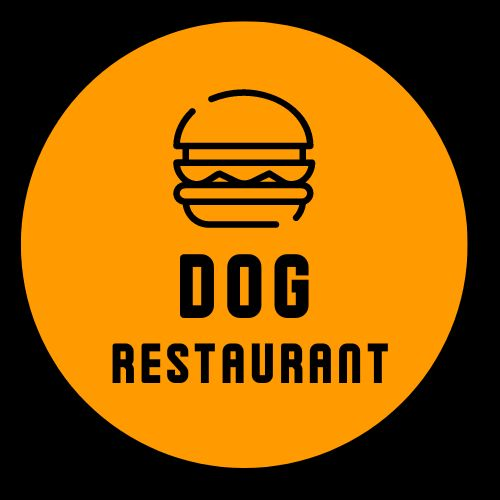

<!-- <p align="center">
 </a>
</p> -->

<h3 align="center">dog-restaurant</h3>

---

<p align="center"> Sistema operacional de uma lanchonete.<br> 
Fornece serviços de gestão de clientes, produtos e pedidos.<br> 
</p>

## 📝 Tabela de Conteúdo

- [Sobre](#about)
- [Comece por aqui](#getting_started)
- [Testes](#tests)
- [Controllers](#controllers)
- [Construído com](#built_using)
- [Autores](#authors)

## 🧐 Sobre <a name = "about"></a>

O dog-restaurant é uma solução integrada projetada para otimizar e simplificar a gestão de operações diárias em estabelecimentos de alimentação. Este sistema fornece serviços de gestão de clientes, produtos e pedidos, permitindo que os proprietários e gerentes mantenham um controle eficiente e organizado de suas operações. Com funcionalidades que vão desde o cadastro e gerenciamento de clientes até a criação e categorização de produtos, o sistema assegura que todas as informações essenciais estejam centralizadas e facilmente acessíveis, melhorando a eficiência operacional e contribuindo para uma melhor experiência do cliente.

## 🏁 Comece por aqui <a name = "getting_started"></a>

Essas instruções irão facilitar rodar o projeto na sua máquina local para fins de desenvolvimento e testes.

### Pré-requisitos

É preciso ter estes itens instalados para o projeto rodar corretamente:

```
- Docker
- Docker Compose
- Kubernetes
- Node.js
- npm
```

## 🔧 Rodando os testes <a name = "tests"></a>

Para rodar os testes unitários, execute `npm test`.

## 📂 Controladores Principais <a name = "controllers"></a>

O sistema possui três principais controladores: Produto, Cliente e Pedido. Abaixo está uma explicação de como cada um funciona e a sequência necessária para utilizá-los corretamente.
1. Produto
   - Primeiro, é necessário criar uma categoria.
   - Em seguida, crie um produto associando-o à categoria criada.
   - Somente após esses passos, o produto estará disponível no endpoint de listagem de produtos.
2. Cliente
   - Para visualizar clientes na listagem, é necessário criar um cliente primeiro.
3. Pedido
   - Para criar um pedido, é necessário fornecer um cliente previamente criado e os produtos que também foram criados.
Espero que isso ajude a esclarecer o funcionamento dos controladores e a sequência necessária para utilizá-los corretamente. Se precisar de mais alguma coisa, estou à disposição!

## ⛏️ Construído com <a name = "built_using"></a>

- [NestJS](https://nestjs.com/) - Server Framework
- [Docker](https://www.docker.com) - Containerization
- [Kubernetes](https://kubernetes.io) - Container Orchestration
- [SQL Server](https://www.microsoft.com/en-us/sql-server) - Database
- [TypeScript](https://www.typescriptlang.org/) - Programming Language


## ✍️ Autores <a name = "authors"></a>

- [@marciliaguilger](https://github.com/marciliaguilger)
- [@BiaLorente](https://github.com/BiaLorente)
